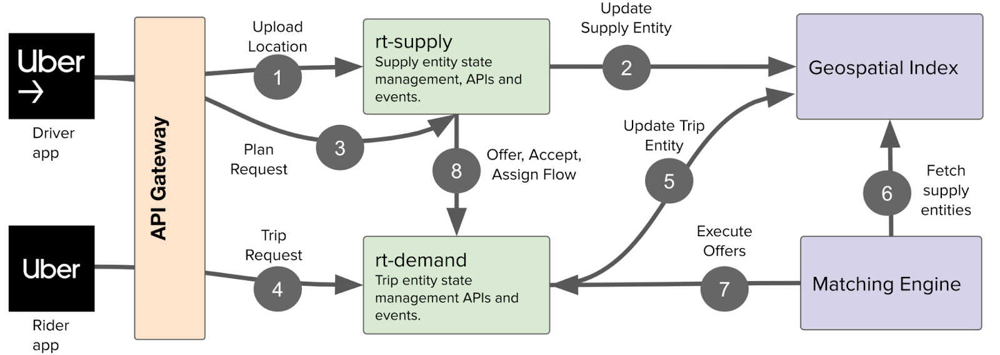
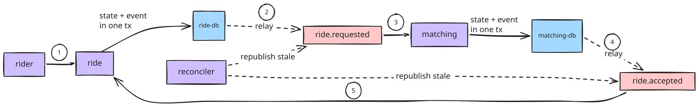

# resilient-distributed-rideshare

A rideshare backend demonstrating resilience patterns (outbox, dedup, crash-recovery and reconciler) during partial failures across microservices.

I started this project to build a rideshare backend, arguably the hardest system design problem out there. Instead, I got pulled into a more foundational problem: how do long-running business transactions stay correct across failures? I set out to build those underlying techniques myself, which taught me firsthand why a workflow engine like [Temporal](https://temporal.io/blog/workflow-engine-principles) exists. If you're familiar with Temporal, I built what it calls _transfer queues_, _task leases_, and _idempotent task application_.

Stack: Go, gRPC, Postgres, Redis, Kafka\*, Docker Compose

> [!WARNING]
> `main` is possibly broken if this warning is up. Switch to a stable version `git checkout redis-streams-working` instead (see [redis-streams-working](https://github.com/beedsneeds/resilient-distributed-rideshare/tree/redis-streams-working))
>
> I'm learning Kafka and migrating my event processing pipeline from Redis Streams to Kafka. Unfortunately it is not a 1:1 replacement so I'll need to change how producers and consumers process events. It's also a great opportunity to revisit my old decisions to see how I've grown and what I can improve.


## Design

<p align="center">

<br>
<em>Src: <a href="https://www.uber.com/us/en/blog/fulfillment-platform-rearchitecture/"> Uber Blog | Ground-up Rearchitecture of Uber's Fulfillment Platform </a> </em>
</p>

<p align="center">

</p>

My goal was to model a subset of Uber's flow:
- **Rider** issues ride requests over gRPC. Requests are idempotent.
- **Ride** owns the ride lifecycle. Temporal's transfer queue: state and its outgoing event commit together, and a relay publishes to a message queue after. Also seen in Matching.
- **Matching** consumes events from the message queue (idempotently) and assigns a driver asynchronously. Used a per-driver lock, which is something I'd want to revisit later.
- **Reconciler** sweeps for rides stuck mid-flight and republishes any event that turned stale.


Each service emits events about its own domain and has its own dedicated database. Ride and Matching are loosely coupled and communicate asynchronously over a message queue. The creation of a Ride request is the [pivot transaction](https://learn.microsoft.com/en-us/azure/architecture/patterns/saga#key-concepts-in-the-saga-pattern) because the rideshare can't cancel a ride after a user makes a successful request. 

I skipped parts of the flow that just repeat the patterns covered above (the Uber blog above explains it wonderfully). I also left out two functionalities: all human UX failure modes (since simulated user behavior isn't interesting) and location (too much complexity for this learning project imo). 

## Failure scenarios

Each number in the flow marks a failure point: a place a service can crash mid-flight.

| # | Failure point | Scenarios | What recovers it |
|---|---|---|---|
| 1 | ride commits but crashes before the rider hears back | `ride-request-retry` | rider retries with the same idempotency key, gets the existing ride back |
| 2 | relay claims an outbox row, or publishes without marking it published | `ride-claim-timeout`, `ride-ghost-message` | the 15s claim lease expires and it republishes; matching's dedup absorbs the duplicate |
| 3 | matching commits the match, crashes before acking | `matching-pel-recovery` | the unacked message is redelivered |
| 4 | same failures as #2, but on the matching side | `matching-claim-timeout`, `matching-ghost-message` | identical recovery as #2 |
| 5 | ride panics inside the accepted-handler transaction | `ride-accepted-rollback` | the transaction rolled back, so redelivery reapplies it cleanly |


## Setup

Launch the project in a [devcontainer](https://code.visualstudio.com/docs/devcontainers/containers)

Run each command in a separate terminal:

```bash
cd services/ride && go run .        # gRPC server, owns ride lifecycle

cd services/matching && go run .    # consumes ride.requested, assigns drivers

cd services/rider && go run .       # gRPC client, generates ride requests

cd services/reconciler && go run .  # background reconciler for orphaned state
```

After you've inspected the normal behavior of the system, in another terminal, run the interactive script and follow the prompts

```bash
./faultinject/faults.sh <failure-scenario>
```

Supported Failure Scenarios:

- matching-ghost-message
- ride-ghost-message
- matching-claim-timeout
- ride-claim-timeout
- matching-pel-recovery
- ride-accepted-rollback
- ride-request-retry

Don't forget to reset state between runs with `./faultinject/resetstate.sh`

Troubleshooting: If the services do not recover, reset db state and try again. If that doesn't work, let me know, it'll help me out a ton.

